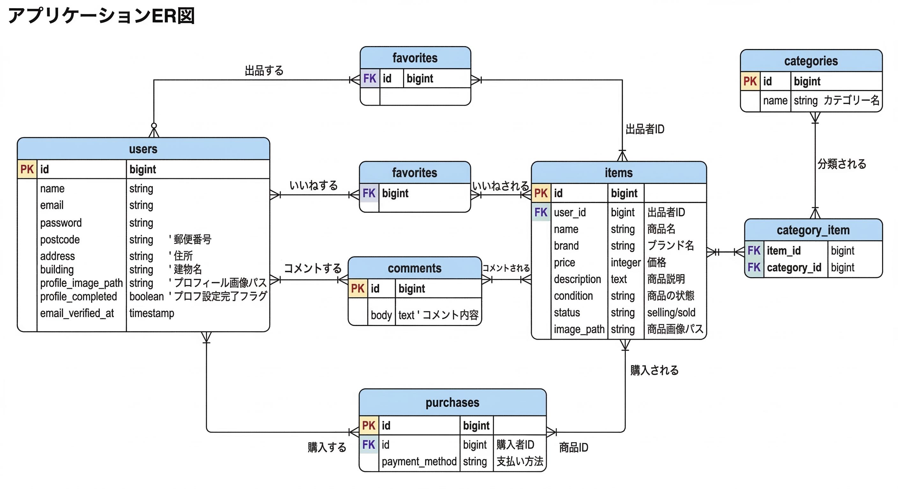

# アプリケーション名
Contact Form / Admin Management App

## 環境構築
-コンテナ起動
docker compose up -d --build
-PHPコンテナに入る
docker compose exec php bash
-依存関係インストール
composer install
-環境設定
cp .env.example .env
php artisan key:generate
-マイグレーション・シーディング
php artisan migrate --seed

##使用技術（実行環境）
PHP 8.x
Laravel 8.x
MySQL 8.x
Docker / Docker Compose
Nginx

##ER図

##URL

開発環境: http://localhost
管理画面: http://localhost/admin