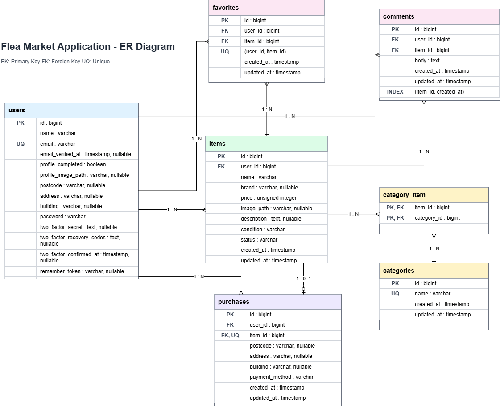

アプリケーション名（フリマアプリ）

環境構築
Dockerを使用して環境構築を行います。以下の手順に従って実行してください。

リポジトリのクローン

Bash
git clone git@github.com:toomochin/flea-market-application.git
Dockerコンテナのビルドと起動

Bash
docker-compose up -d --build
PHPコンテナ内でのセットアップ

Bash
docker-compose exec php bash

# 依存パッケージのインストール
composer install

# 環境設定ファイルの作成
cp .env.example .env
php artisan key:generate

# マイグレーションとシーディング（初期データの投入）
php artisan migrate:fresh --seed

使用技術（実行環境）
PHP: 8.x

Framework: Laravel 8.x

Database: MySQL

Infrastructure: Docker / Docker Compose

Authentication: Laravel Fortify

ER図

開発環境: http://localhost/